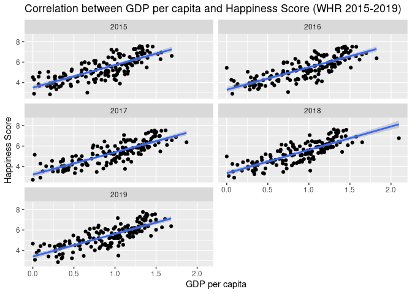

The Relationship Between World Happiness Report and WHO Country Suicide
Rates - an Analysis
================
Lab rats: Kristaps Brics, Cora Carvalho and Cheyanne Goroshin

## 1. Introduction

Our group had a common interest in public health and thought the topic
would have ample opportunity for data analysis. We were able to find
large data sets on suicide mortality rates from around the world, but
wanted to know what factors contributed to higher or lower suicide rates
in various countries. We decided that comparing suicide rates to World
Happiness Report (WHR) scores would allow us to see how the data
narrates mental health for each country, and what specific variables
show large contribution. WHR includes many independent variables, such
as GDP per capita, family size, trust in government, generosity, etc. We
agreed that GDP per capita would allow us to see exactly how economy
affects peoples’ happiness, and therefore increase or decrease rates of
happiness.

#### Primary research question:

##### How does the ranking of a certain country on the World Happiness Report correlate with their respective suicide mortality rate?

#### Secondary research question:

##### How does GDP per capita impact happiness, and to what extent does that data correlate with suicide mortality rates?

## 2. Data

We chose two main datasets for our project. The first one was a
compilation of suicide rates from the majority of countries created by
the World Health Organization (WHO) for the period 2000 to 2019 (source:
<https://www.kaggle.com/datasets/mikekzan/who-crude-suicide-mortality-rate>).
The second one was a collection of scores of the WHR from 2015 to 2019,
with data for each year located in a separate subdataset (source:
<https://www.kaggle.com/datasets/unsdsn/world-happiness>).

However, we modified these datasets to a significant degree to fit our
needs. We cleaned all the WHR datasets to have more consistency
regarding the countries portrayed each year and the names of variables,
as well as the order in which they appeared in each dataset. We also
deleted the region columns in the WHR datasets that had them, because
the categorization was not homogeneous across datasets. We also created
a new column in each of them called `year`, to be able to bind all WHR
datasets into one. Additionally, we had to standardize the names of
countries, because yearly there was some discrepancy in how some names
were reportes. We also wanted to make sure that both the WHO suicide
dataset and the WHR datasets had the same input for country names.
Because some countries are not recognized by the UN or a big enough
number of other nation states, we did exclude them from `whr_2`.
However, they can still be viewed in the initial compiled dataset `whr`.
In addition to all these changes, we also used the `expand()` function
to produce rows of all-time reported countries in all the years from
2015 to 2019, which provided us with information on missing values by
country and year.

In the WHO `suicide` dataset, we deleted severall columns that would not
be required for the purposes of our analysis, leaving only `country`,
`year`, `sex`, `age_group`, and `suicide_rates`. The original dataset we
extracted from kaggle had several different crude suicide rate variables
(i.e. numeric, percentage, high estimate, low estimate), but we decided
to only consider the `suicide_rates` numeric variable for our analysis.
As previously stated, we did standadized country names in the WHO
suicide data as well. We also used the `expand()` function to get the
missing values by `country`, `age_group`, `sex`, and `year`. Because
different countries reported results in different ways, some of them
have summarized values in categories such as “All ages” and “Both
sexes”, and some have this information only in subdivided categories of
“Female”, “Male”, etc. Expanding the values to show the “NAs” was
important to see how much missing information we had in this dataset.

We had initial plans to add a new `region` column to the both the WHR
and WHO suicide datasets to make geographical analysis. However, due to
all the time we spent tidying the data, we did not have enough time to
do that so far. We will determine after we get some more visualizations
if we still have time to add one more variable to the equation.

Initially, we also thought to make an analysis associating light
exposure to the happiness index and suicide rates. However, in our
preliminary research so far we could not find a dataset with this
information by country. We will continue the research to see if it is
possible to add this variable from another dataset.

Our first graph will be a scatterplot showing the correlation between
the WHR scores and suicide mortality rates of all countries. Then we
plan to create such a graph for each region, if we have the time to add
the `region` variable to our datasets. Afterwards, we want to plot the
correlation between GDP per capita (a variable in the WHR datasets) and
the happiness score on a global and regional scale. Lastly, we want to
create graphs showing the correlation of the two aforementioned
variables with suicide mortality rates. However,it is of utmost
importance to state that our plans are subject to change as the project
evolves.

Below we apply the function `glimpse` and `skim` to show a summary of
our datasets. We also include a preliminary visualization based on these
data.

##### WHR Summary

``` r
glimpse(whr) 
```

    ## Rows: 782
    ## Columns: 10
    ## $ overall_rank              <dbl> 153, 154, 141, 145, 154, 95, 109, 109, 112, …
    ## $ country                   <chr> "Afghanistan", "Afghanistan", "Afghanistan",…
    ## $ happiness_score           <dbl> 3.575, 3.360, 3.794, 3.632, 3.203, 4.959, 4.…
    ## $ gdp_per_capita            <dbl> 0.3198200, 0.3822700, 0.4014772, 0.3320000, …
    ## $ social_support            <dbl> 0.3028500, 0.1103700, 0.5815433, 0.5370000, …
    ## $ life_expectancy           <dbl> 0.30335000, 0.17344000, 0.18074678, 0.255000…
    ## $ freedom                   <dbl> 0.2341400, 0.1643000, 0.1061795, 0.0850000, …
    ## $ generosity                <dbl> 0.36510000, 0.31268000, 0.31187093, 0.191000…
    ## $ perceptions_of_corruption <chr> "0.09719", "0.07112", "0.0611578300595284", …
    ## $ year                      <dbl> 2015, 2016, 2017, 2018, 2019, 2015, 2016, 20…

``` r
skim(whr)
```

|                                                  |      |
|:-------------------------------------------------|:-----|
| Name                                             | whr  |
| Number of rows                                   | 782  |
| Number of columns                                | 10   |
| \_\_\_\_\_\_\_\_\_\_\_\_\_\_\_\_\_\_\_\_\_\_\_   |      |
| Column type frequency:                           |      |
| character                                        | 2    |
| numeric                                          | 8    |
| \_\_\_\_\_\_\_\_\_\_\_\_\_\_\_\_\_\_\_\_\_\_\_\_ |      |
| Group variables                                  | None |

Data summary

**Variable type: character**

| skim_variable             | n_missing | complete_rate | min | max | empty | n_unique | whitespace |
|:--------------------------|----------:|--------------:|----:|----:|------:|---------:|-----------:|
| country                   |         0 |             1 |   2 |  24 |     0 |      169 |          0 |
| perceptions_of_corruption |         0 |             1 |   1 |  19 |     0 |      643 |          0 |

**Variable type: numeric**

| skim_variable   | n_missing | complete_rate |    mean |    sd |      p0 |     p25 |     p50 |     p75 |    p100 | hist  |
|:----------------|----------:|--------------:|--------:|------:|--------:|--------:|--------:|--------:|--------:|:------|
| overall_rank    |         0 |             1 |   78.70 | 45.18 |    1.00 |   40.00 |   79.00 |  118.00 |  158.00 | ▇▇▇▇▇ |
| happiness_score |         0 |             1 |    5.38 |  1.13 |    2.69 |    4.51 |    5.32 |    6.19 |    7.77 | ▂▇▇▇▃ |
| gdp_per_capita  |         0 |             1 |    0.92 |  0.41 |    0.00 |    0.61 |    0.98 |    1.24 |    2.10 | ▃▅▇▅▁ |
| social_support  |         0 |             1 |    1.08 |  0.33 |    0.00 |    0.87 |    1.12 |    1.33 |    1.64 | ▁▂▅▇▆ |
| life_expectancy |         0 |             1 |    0.61 |  0.25 |    0.00 |    0.44 |    0.65 |    0.81 |    1.14 | ▂▃▆▇▂ |
| freedom         |         0 |             1 |    0.41 |  0.15 |    0.00 |    0.31 |    0.43 |    0.53 |    0.72 | ▂▃▆▇▃ |
| generosity      |         0 |             1 |    0.22 |  0.12 |    0.00 |    0.13 |    0.20 |    0.28 |    0.84 | ▆▇▂▁▁ |
| year            |         0 |             1 | 2016.99 |  1.42 | 2015.00 | 2016.00 | 2017.00 | 2018.00 | 2019.00 | ▇▇▇▇▇ |

##### WHR_2 Summary

``` r
glimpse(whr_2) 
```

    ## Rows: 777
    ## Columns: 10
    ## $ overall_rank              <dbl> 153, 154, 141, 145, 154, 95, 109, 109, 112, …
    ## $ country                   <chr> "Afghanistan", "Afghanistan", "Afghanistan",…
    ## $ happiness_score           <dbl> 3.575, 3.360, 3.794, 3.632, 3.203, 4.959, 4.…
    ## $ gdp_per_capita            <dbl> 0.3198200, 0.3822700, 0.4014772, 0.3320000, …
    ## $ social_support            <dbl> 0.3028500, 0.1103700, 0.5815433, 0.5370000, …
    ## $ life_expectancy           <dbl> 0.30335000, 0.17344000, 0.18074678, 0.255000…
    ## $ freedom                   <dbl> 0.2341400, 0.1643000, 0.1061795, 0.0850000, …
    ## $ generosity                <dbl> 0.36510000, 0.31268000, 0.31187093, 0.191000…
    ## $ perceptions_of_corruption <chr> "0.09719", "0.07112", "0.0611578300595284", …
    ## $ year                      <dbl> 2015, 2016, 2017, 2018, 2019, 2015, 2016, 20…

``` r
skim(whr_2)
```

|                                                  |       |
|:-------------------------------------------------|:------|
| Name                                             | whr_2 |
| Number of rows                                   | 777   |
| Number of columns                                | 10    |
| \_\_\_\_\_\_\_\_\_\_\_\_\_\_\_\_\_\_\_\_\_\_\_   |       |
| Column type frequency:                           |       |
| character                                        | 2     |
| numeric                                          | 8     |
| \_\_\_\_\_\_\_\_\_\_\_\_\_\_\_\_\_\_\_\_\_\_\_\_ |       |
| Group variables                                  | None  |

Data summary

**Variable type: character**

| skim_variable             | n_missing | complete_rate | min | max | empty | n_unique | whitespace |
|:--------------------------|----------:|--------------:|----:|----:|------:|---------:|-----------:|
| country                   |         0 |             1 |   2 |  24 |     0 |      167 |          0 |
| perceptions_of_corruption |         0 |             1 |   1 |  19 |     0 |      639 |          0 |

**Variable type: numeric**

| skim_variable   | n_missing | complete_rate |    mean |    sd |      p0 |     p25 |     p50 |     p75 |    p100 | hist  |
|:----------------|----------:|--------------:|--------:|------:|--------:|--------:|--------:|--------:|--------:|:------|
| overall_rank    |         0 |             1 |   78.80 | 45.31 |    1.00 |   39.00 |   79.00 |  118.00 |  158.00 | ▇▇▇▇▇ |
| happiness_score |         0 |             1 |    5.38 |  1.13 |    2.69 |    4.51 |    5.31 |    6.19 |    7.77 | ▂▇▇▇▃ |
| gdp_per_capita  |         0 |             1 |    0.91 |  0.41 |    0.00 |    0.60 |    0.98 |    1.23 |    2.10 | ▃▅▇▅▁ |
| social_support  |         0 |             1 |    1.08 |  0.33 |    0.00 |    0.87 |    1.12 |    1.33 |    1.64 | ▁▂▅▇▆ |
| life_expectancy |         0 |             1 |    0.61 |  0.25 |    0.00 |    0.44 |    0.65 |    0.81 |    1.14 | ▂▃▆▇▂ |
| freedom         |         0 |             1 |    0.41 |  0.15 |    0.00 |    0.31 |    0.43 |    0.53 |    0.72 | ▂▃▆▇▃ |
| generosity      |         0 |             1 |    0.22 |  0.12 |    0.00 |    0.13 |    0.20 |    0.28 |    0.84 | ▆▇▂▁▁ |
| year            |         0 |             1 | 2016.99 |  1.42 | 2015.00 | 2016.00 | 2017.00 | 2018.00 | 2019.00 | ▇▇▇▇▇ |

##### WHO suicide Summary

``` r
glimpse(suicide) 
```

    ## Rows: 8,784
    ## Columns: 5
    ## $ country       <chr> "Antigua and Barbuda", "Antigua and Barbuda", "Antigua a…
    ## $ year          <dbl> 2019, 2019, 2019, 2019, 2019, 2019, 2019, 2019, 2019, 20…
    ## $ sex           <chr> "Both sexes", "Both sexes", "Both sexes", "Both sexes", …
    ## $ age_group     <chr> "15-19 years", "15-24 years", "15-29  years", "25-34 yea…
    ## $ suicide_rates <dbl> 0, 0, 0, 0, 0, 0, 0, 0, 0, 0, 0, 0, 0, 0, 0, 0, 0, 0, 0,…

``` r
skim(suicide)
```

|                                                  |         |
|:-------------------------------------------------|:--------|
| Name                                             | suicide |
| Number of rows                                   | 8784    |
| Number of columns                                | 5       |
| \_\_\_\_\_\_\_\_\_\_\_\_\_\_\_\_\_\_\_\_\_\_\_   |         |
| Column type frequency:                           |         |
| character                                        | 3       |
| numeric                                          | 2       |
| \_\_\_\_\_\_\_\_\_\_\_\_\_\_\_\_\_\_\_\_\_\_\_\_ |         |
| Group variables                                  | None    |

Data summary

**Variable type: character**

| skim_variable | n_missing | complete_rate | min | max | empty | n_unique | whitespace |
|:--------------|----------:|--------------:|----:|----:|------:|---------:|-----------:|
| country       |         0 |             1 |   2 |  32 |     0 |      183 |          0 |
| sex           |         0 |             1 |   4 |  10 |     0 |        3 |          0 |
| age_group     |         0 |             1 |   8 |  12 |     0 |       12 |          0 |

**Variable type: numeric**

| skim_variable | n_missing | complete_rate |    mean |    sd |   p0 |     p25 |     p50 |     p75 | p100 | hist  |
|:--------------|----------:|--------------:|--------:|------:|-----:|--------:|--------:|--------:|-----:|:------|
| year          |         0 |             1 | 2018.38 |  1.22 | 2015 | 2018.75 | 2019.00 | 2019.00 | 2019 | ▁▁▁▁▇ |
| suicide_rates |         0 |             1 |   16.39 | 32.53 |    0 |    3.96 |    8.06 |   16.36 |  646 | ▇▁▁▁▁ |

##### WHO suicide_2 Summary

``` r
glimpse(suicide_2) 
```

    ## Rows: 32,940
    ## Columns: 5
    ## $ country       <chr> "Antigua and Barbuda", "Antigua and Barbuda", "Antigua a…
    ## $ year          <dbl> 2019, 2019, 2019, 2019, 2019, 2019, 2019, 2019, 2019, 20…
    ## $ sex           <chr> "Both sexes", "Both sexes", "Both sexes", "Both sexes", …
    ## $ age_group     <chr> "15-19 years", "15-24 years", "15-29  years", "25-34 yea…
    ## $ suicide_rates <dbl> 0, 0, 0, 0, 0, 0, 0, 0, 0, 0, 0, 0, 0, 0, 0, 0, 0, 0, 0,…

``` r
skim(suicide_2)
```

|                                                  |           |
|:-------------------------------------------------|:----------|
| Name                                             | suicide_2 |
| Number of rows                                   | 32940     |
| Number of columns                                | 5         |
| \_\_\_\_\_\_\_\_\_\_\_\_\_\_\_\_\_\_\_\_\_\_\_   |           |
| Column type frequency:                           |           |
| character                                        | 3         |
| numeric                                          | 2         |
| \_\_\_\_\_\_\_\_\_\_\_\_\_\_\_\_\_\_\_\_\_\_\_\_ |           |
| Group variables                                  | None      |

Data summary

**Variable type: character**

| skim_variable | n_missing | complete_rate | min | max | empty | n_unique | whitespace |
|:--------------|----------:|--------------:|----:|----:|------:|---------:|-----------:|
| country       |         0 |             1 |   2 |  32 |     0 |      183 |          0 |
| sex           |         0 |             1 |   4 |  10 |     0 |        3 |          0 |
| age_group     |         0 |             1 |   8 |  12 |     0 |       12 |          0 |

**Variable type: numeric**

| skim_variable | n_missing | complete_rate |    mean |    sd |   p0 |     p25 |     p50 |     p75 | p100 | hist  |
|:--------------|----------:|--------------:|--------:|------:|-----:|--------:|--------:|--------:|-----:|:------|
| year          |         0 |          1.00 | 2017.00 |  1.41 | 2015 | 2016.00 | 2017.00 | 2018.00 | 2019 | ▇▇▇▇▇ |
| suicide_rates |     24156 |          0.27 |   16.39 | 32.53 |    0 |    3.96 |    8.06 |   16.36 |  646 | ▇▁▁▁▁ |

##### Preliminary Visualization

``` r
whr %>% 
  filter(year %in% c(2015, 2016, 2017, 2018, 2019)) %>%
  ggplot(aes(x = gdp_per_capita, y = happiness_score)) +
  geom_point() +
  geom_smooth(method = "lm") +
  labs(x = "GDP per capita",
       y = "Happiness Score", 
       title = "Correlation between GDP per capita and Happiness Score (WHR 2015-2019)") +
  facet_wrap(~ year, ncol = 2)
```

    ## `geom_smooth()` using formula = 'y ~ x'

<!-- -->

## 3. Data analysis plan

Variables we will consider for our analysis:

World Happiness Report datase, `whr`:

\$ `overall_rank`  
\$ `country`  
\$ `happiness_score`  
\$ `gdp_per_capita`  
\$ `social_support`  
\$ `life_expectancy`  
\$ `freedom`  
\$ `generosity`  
\$ `perceptions_of_corruption`  
\$ `year`

World Suicide rates dataset, `suicide`, for the years between 2015-2019:

\$ `country`  
\$ `year`  
\$ `sex`  
\$ `age_group`  
\$ `suicide_rates`

Since our dataset has a large set of observations, considering around
170 countries from the world total, we envision several possibilities to
run our analysis. We could:

- consider all of the countries in the dataset, grouping them by their
  regions
- select a specific number of regions to analyze
- equalize the population numbers for each region, trying to sample an
  equal amount of people per region/continent to be analyzed. Doing so,
  we would have to randomly exclude some countries of the analysis.
- choose specific countries to compare and contrast, dimishing
  considerably the number of observations.
